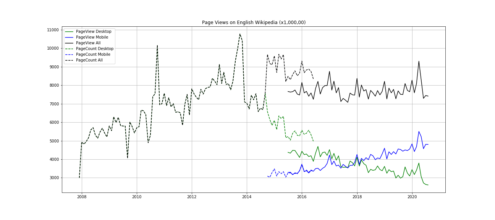

# A1: Data Curation

The goal of this assignment is to construct, analyze, and publish a dataset of monthly traffic on English Wikipedia from January 1 2008 through August 30 2020.

## Data Source

The data for the analysis has been collected from two different APIs-
1. The Legacy Pagecount API ([Documentation](https://wikitech.wikimedia.org/wiki/Analytics/AQS/Legacy_Pagecounts), [Endpoint](https://wikimedia.org/api/rest_v1/#/Legacy%20data)), at monthly granularity: December 2007 - July 2016
2. The Pageviews API ([Documentation](https://wikitech.wikimedia.org/wiki/Analytics/AQS/Pageviews), [Endpoint](https://wikimedia.org/api/rest_v1/#/Pageviews%20data)), at monthly granularity: July 2015 - August 2020

## Data Description

The following are the fields in the [final csv data file](data/csv/en-wikipedia_traffic_200712-202008.csv)

| Column | Description |
|--------|-------------|
| `year`   | The year of the data point |
| `month`  | The month of the data point. The year-month pair serve as a key |
| `pagecount_all_views` | The total number of views as recorded by the Page Count API |
| `pageview_desktop_views` | The number of views as recorded by desktop site (web) visits |
| `pageview_mobile_views` | The number of views as recorded by mobile (app + web) visits |
| `pageview_all_views` | The total number of views as recorded by the PageView API |
| `pagecount_desktop_views` | The number of views as recorded by desktop site visits |
| `pagecount_mobile_views` | The number of views as recorded by mobile visits by the legacy API |

### Data Considerations

The following considerations are to be taken into account for the given data:

1. The Pageviews API provides a mechanism to filter by user agent. As a result, the final dataset has the minor anomaly that the pagecount values include bots (spiders/crawlers/etc), whereas the pageview values does not.
2. Data for different access types (desktop, mobile-app, mobile-site) contains data for non-overlapping years. While creating the `pagecount_all_views` and `pageview_all_views`, the counts for the missing years is considered to be 0. However this does not necessarily imply that there were no pageviews or pagecounts during those periods.

## Directory Structure

```
.
├── data
│   └── csv
│        └── en-wikipedia_traffic_200712-202008.csv
│   └── json
│        ├── pagecounts_desktop-site_200712-201607.json
│        ├── pagecounts_mobile-site_200712-201607.json
│        ├── pageviews_desktop_201507-202009.json
│        ├── pageviews_mobile-app_201507-202009.json
│        └── pageviews_mobile-web_201507-202009.json
├── README.md
├── LICENCE
├── final_visualization.png
└── data512-a1-data-curation.ipynb  

```

## Final Visualization



## License

This code is available under the [MIT License](LICENSE)

Text is available under the [Creative Commons Attribution-ShareAlike License](https://creativecommons.org/licenses/by-sa/3.0/); additional terms may apply. See [Terms of Use](https://foundation.wikimedia.org/wiki/Terms_of_Use/en) for details.

Wikimedia Foundation REST API [Terms of Use](https://www.mediawiki.org/wiki/REST_API#Terms_and_conditions).
