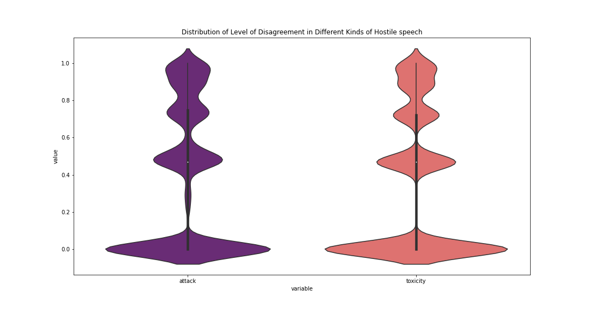
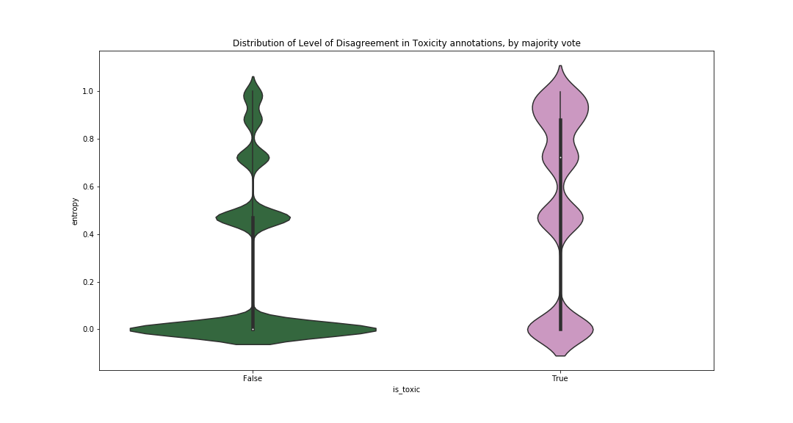
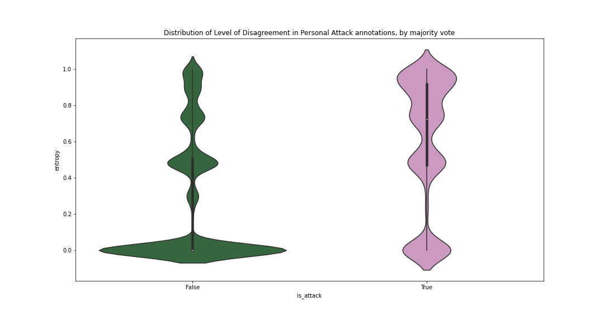
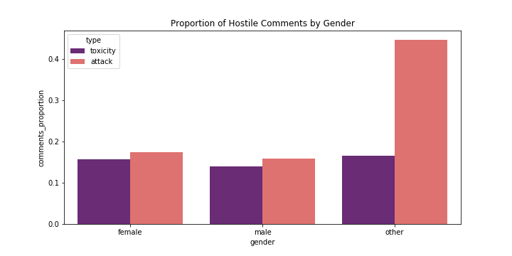
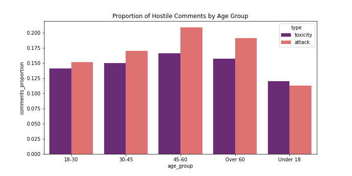
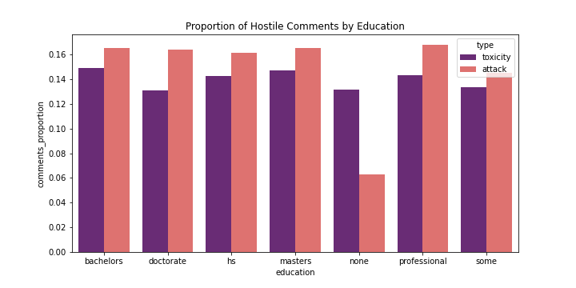
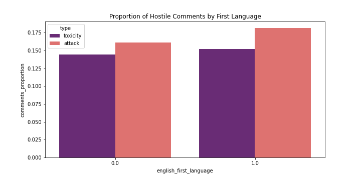

# A2: Bias in Data

The goal of this assignment is to identify potential sources of bias in the Wikipedia Talk corpus of data annotated by annotators from Crowdflower, and describe some implications of those biases.  

More details about the research project and the models trained on the corpus can be found at [Wikimedia Research:Detox](https://meta.wikimedia.org/wiki/Research:Detox) and the [Perspective API on GitHub](https://github.com/conversationai/perspectiveapi/blob/master/2-api/methods.md).

## Data Source

The data for the analysis has been collected from [Figshare](https://figshare.com/projects/Wikipedia_Talk/16731)  and the data schema can be found [here](https://meta.wikimedia.org/wiki/Research:Detox/Data_Release).  
The analysis focuses on the following two datasets:  
1. [Toxicity](https://figshare.com/articles/dataset/Wikipedia_Talk_Labels_Toxicity/4563973): 160k labeled comments from English Wikipedia by approximately 10 annotators via Crowdflower on a spectrum of how toxic the comment is (perceived as likely to make people want to leave the discussion) to how healthy to conversation the contribution is.
2. [Personal Attacks](https://figshare.com/articles/dataset/Wikipedia_Talk_Labels_Personal_Attacks/4054689): 100k labeled comments from English Wikipedia by approximately of 10 annotators via Crowdflower on whether it contains a personal attack.


## Directory Structure

```
.
├── data
│   ├── attack_annotated_comments.tsv
|   ├── attack_annotations.tsv
│   ├── attack_worker_demographics.tsv
│   ├── toxicity_annotated_comments.tsv
│   ├── toxicity_annotations.tsv
│   └── toxicity_worker_demographics.tsv
├── images
│   ├── hostile_comments_by_age.png
|   ├── hostile_comments_by_education.png
│   ├── hostile_comments_by_gender.png
│   ├── hostile_comments_by_language.png
│   ├── label_disagreement_attack.png
│   ├── label_disagreement_toxic_vs_attack.png
│   └── label_disagreement_toxicity.png
├── README.md
├── LICENCE
└── data512-a2-bias-in-data.ipynb

```

## Analysis Questions

### I. Analyze the level of disagreement among crowdworkers around certain labels

**Question**.  How much do labelers tend to agree while labelling hostile speech? Do people disagree more to a comment more likely to be labeled as hostile? Are some kinds of hostile speech harder for people to agree on than others? For example, do labelers tend to disagree more about “personal attacks” vs. “toxicity”?

**Results**. We observe that labelers are equally likely to disagree while labelling toxicity and personal attacks. We however observe that while labellers are likely to disagree more on comments which majority label as hostile (toxic/attack). Labellers are likely to agree more while labelling a comment as not hostile. The increased uncertainty while labeling hostile comments could result in lower performance of classifiers.


Toxicity vs Attacks             |  Toxic vs Non Toxic          |  Attack vs Non Attack
:-------------------------:|:-------------------------:|:-------------------------:
  |    | 


### II. Explore relationships between worker demographics and labeling behavior

**Question**.  How consistent are labelling behaviors among workers with different demographic profiles? For example, are female-identified labelers more or less likely to label comments as aggressive than male-identified labelers?

**Results**. We observe that there is a similar proportions being tagged as toxic or attack among the different age groups and first language. We see that while the proportion of comments marked as toxic remains similar between different genders, there is an increase in the proportion of comments that workers of 'other' gender label as containing attacks. The possible reason for this could be that the comments annotated for attacks may contain words pertaining to gender or hostile comments for non-binary people.  
We also see that workers with no educational background labelled fewer comments as containing personal attacks.

Gender             |     Age Group       
:-------------------------:|:-------------------------:
  |    


Education             |     First Language       
:-------------------------:|:-------------------------:
  |    

The jupyter notebook containing the analyis code can be found [here](data512-a2-bias-in-data.ipynb).

## License

This code is available under the [MIT License](LICENSE)

Wulczyn, Ellery; Thain, Nithum; Dixon, Lucas (2017): Wikipedia Talk Labels: Personal Attacks. figshare. Dataset. https://doi.org/10.6084/m9.figshare.4054689.v6

Thain, Nithum; Dixon, Lucas; Wulczyn, Ellery (2017): Wikipedia Talk Labels: Toxicity. figshare. Dataset. https://doi.org/10.6084/m9.figshare.4563973.v2

Text is available under the [Creative Commons Attribution-ShareAlike License](https://creativecommons.org/licenses/by-sa/3.0/); additional terms may apply. See [Terms of Use](https://foundation.wikimedia.org/wiki/Terms_of_Use/en) for details.
